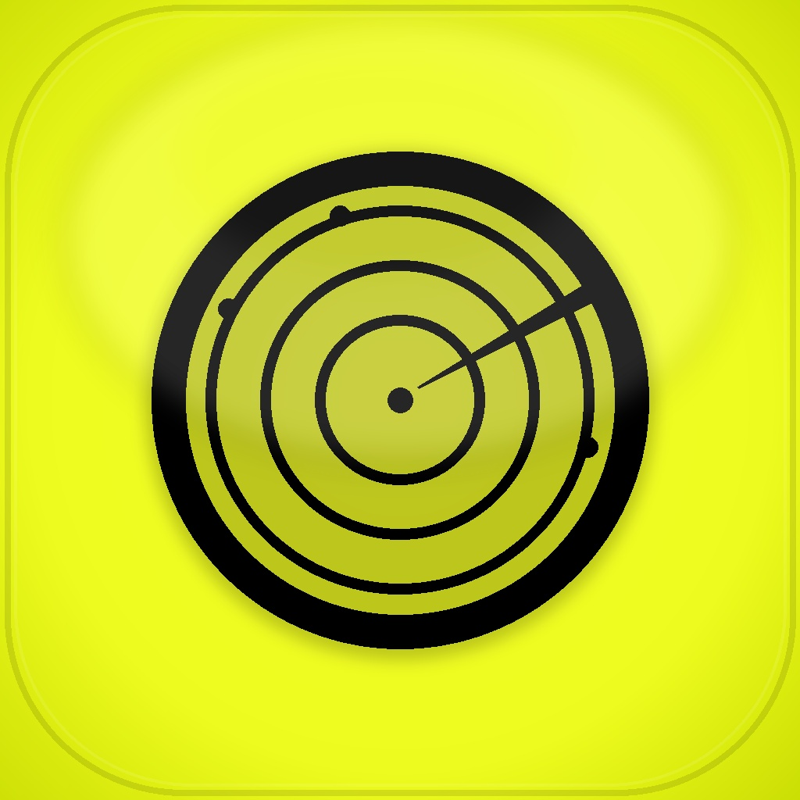

<p align="center">
  
</p>

<h1 align="center">Patroller</h1>

<p align="center">
  <strong>Open-source Flutter desktop workbench for <a href="https://patrol.leancode.co">Patrol</a> UI tests</strong><br/>
  Run, develop, record, and agent-assist Patrol flows - without living in the terminal.
</p>

<p align="center">
  <a href="https://github.com/aiman-hanif-dolah/patroller/stargazers"></a>
  <a href="https://github.com/aiman-hanif-dolah/patroller/network/members"></a>
  <a href="LICENSE"></a>
  <a href="https://flutter.dev"></a>
  <a href="#platforms"></a>
</p>

<p align="center">
  <a href="#-why-patroller">Why</a> ·
  <a href="#-features">Features</a> ·
  <a href="#-quick-start">Quick start</a> ·
  <a href="#-fork--contribute">Fork</a> ·
  <a href="#-architecture">Architecture</a> ·
  <a href="#-license">License</a>
</p>

---

## 🎯 Why Patroller?

[Patrol](https://patrol.leancode.co) is excellent for Flutter E2E UI tests - but the day-to-day loop is still heavy: devices, `patrol test` / `patrol develop`, logs, recordings, MCP agents, and health checks scattered across terminals and IDEs.

**Patroller** is a **native Flutter desktop app** that turns that loop into a visual workbench:

| Pain | Patroller |
|------|-----------|
| Hunt for devices & boot simulators | Device picker + auto-boot |
| Re-type long `patrol` commands | One-click Test / Develop / Stop |
| Scroll raw terminal spam | Live logs with filters, search, export |
| “Did this project work last week?” | Per-project run history |
| Wire MCP for AI agents by hand | Agent workbench installs & binds MCP |
| Capture a flow as code | Record → export `patrolTest` Dart / flow editor |

Built with **pure Dart process control** - no Electron shell, no WebView tax for the main UI.

---

## ✨ Features

- **Landing & projects** - open Flutter projects, recent list, validation
- **Test explorer** - search, multi-select, status badges
- **Runner** - Test / Test All / Develop / Develop All / Stop
- **Devices** - list, boot, shutdown; simulator-first workflows on macOS
- **Live logs** - batching, filters, search, failed-log focus, export
- **Run history** - retained per project
- **Environment health** - Flutter, Patrol CLI, simctl, paths (FVM-aware)
- **Recordings** - capture Simulator interactions, replay, export Patrol code
- **Visual flow editor** - edit steps → generate / run Patrol-oriented flows
- **Agent workbench** - install Patrol MCP + Marionette MCP on the machine, bind Cursor config, fill agent prompts
- **DevTools extension** - local HTTP + WebSocket API + panel (`/panel`)
- **Keyboard shortcuts** - ⌘O open, ⌘R test, ⇧⌘R test all, ⌘D develop, and more

> Settings and history live under the shared **Patrol Studio** data folder so Electron / Tauri / Flutter editions can coexist:
> - **macOS:** `~/Library/Application Support/Patrol Studio/`
> - **Windows:** `%APPDATA%\Patrol Studio\`

---

## 🖥️ Platforms

| Platform | App UI | Running Patrol tests |
|----------|--------|----------------------|
| **macOS** | ✅ Full | ✅ iOS Simulator (+ tooling) |
| **Windows** | ✅ Full | UI works; mobile test runs depend on your connected toolchains |

---

## 🚀 Quick start

### Requirements

- [Flutter](https://docs.flutter.dev/get-started/install) **3.3+**
- [Patrol CLI](https://pub.dev/packages/patrol_cli) (`dart pub global activate patrol_cli`)
- macOS: Xcode + iOS Simulator for full runner workflows

### Clone & run

```bash
git clone https://github.com/aiman-hanif-dolah/patroller.git
cd patroller
flutter pub get
flutter run -d macos      # or: flutter run -d windows
```

### Release build (macOS)

```bash
flutter build macos
open build/macos/Build/Products/Release/Patroller.app
```

### Optional: reinstall helper

```bash
./scripts/reinstall-macos.sh
```

---

## 🤖 Agent + MCP workflow

MCP servers are **installed on your machine**, not injected into every Flutter app’s `pubspec.yaml`.

**From Patroller (recommended)**

1. Open **Agent**
2. **Install / update** Patrol MCP and Marionette MCP
3. Open a Flutter project → **Start MCP routine** (writes Cursor wrapper + merges `~/.cursor/mcp.json`)
4. Use **Agent prompt routines** (e.g. Marionette coverage) → copy prompt into Cursor

**From a terminal (equivalent)**

```bash
dart pub global activate patrol_mcp
dart pub global activate marionette_mcp
```

Patroller prepares MCP + prompts; it does **not** run your AI agent for you.

---

## 🧩 DevTools extension

Enable under **Settings → DevTools Extension** (default port `8771`).

| Method | Path | Purpose |
|--------|------|---------|
| GET | `/health` | Liveness |
| GET | `/devices` | List devices |
| POST | `/runs` | Start a run |
| POST | `/runs/<id>/stop` | Stop a run |
| GET | `/panel` | Built extension UI |
| WS | `/ws` | Logs / status stream |

Open the panel at **`http://localhost:8771/panel`** while Patroller is running.

Build / refresh panel assets:

```bash
cd devtools_extension
flutter pub get
flutter build web --release --base-href=/panel/ --no-tree-shake-icons
perl -i -pe 's|<base href="/panel/"\s*/?>|<base href="/">|' build/web/index.html
rm -rf ../extension/devtools/build
cp -R build/web ../extension/devtools/build
```

---

## 🏗️ Architecture

```text
lib/
  models/       # Domain types (settings, devices, runs, recordings)
  services/     # Process spawn, patrol runner, queue, devices, health, MCP
  providers/    # Riverpod state
  features/     # UI: landing, shell, tests, logs, agent, recordings, …
  domain/       # Pure helpers (prompts, readiness, log sanitizing)
  core/theme/   # Design tokens
  widgets/      # Shared UI
  devtools/     # Extension server glue

scripts/        # macOS reinstall, resource bundling, driver build
resources/      # Simulator driver / input-monitor assets
devtools_extension/   # Flutter web panel source
extension/devtools/   # Packaged DevTools extension (config + build)
```

**Stack:** Flutter desktop · Riverpod · `dart:io` process control · optional local shelf HTTP/WS API.

---

## 📊 Edition comparison

| | Electron | Tauri | **Patroller** |
|--|----------|-------|---------------|
| Shell | Chromium | WebView | **Flutter** |
| Backend | Node | Rust | **Dart** |
| Approx. bundle | ~150 MB | ~14 MB | **~44 MB** |
| Shared settings | ✅ | ✅ | ✅ |

---

## 🍴 Fork & contribute

Patroller is **MIT-licensed** and **public** - you are free to fork, modify, and ship your own builds.

### Fork on GitHub

1. Click **[Fork](https://github.com/aiman-hanif-dolah/patroller/fork)** on GitHub.
2. Clone **your** fork:

   ```bash
   git clone https://github.com/<your-username>/patroller.git
   cd patroller
   flutter pub get
   ```

3. Create a branch, make changes, push, open a PR upstream.

### Remote tip

```bash
git remote add upstream https://github.com/aiman-hanif-dolah/patroller.git
git fetch upstream
git merge upstream/main   # or: git rebase upstream/main
```

See **[CONTRIBUTING.md](CONTRIBUTING.md)** for setup, PR checklist, and issue templates under `.github/`.

<p align="center">
  <a href="https://github.com/aiman-hanif-dolah/patroller/fork">
    
  </a>
  <a href="https://github.com/aiman-hanif-dolah/patroller/issues/new/choose">
    
  </a>
  <a href="https://github.com/aiman-hanif-dolah/patroller/stargazers">
    
  </a>
</p>

---

## 🧪 Tests

```bash
flutter test
```

---

## 🔗 Related

- [Patrol](https://patrol.leancode.co) - Flutter-first UI testing
- [patrol](https://pub.dev/packages/patrol) / [patrol_cli](https://pub.dev/packages/patrol_cli) on pub.dev
- LeanCode’s Patrol ecosystem (MCP, finders, docs)

---

## 📄 License

Released under the **[MIT License](LICENSE)** - free to use, fork, modify, and distribute.

```
Copyright (c) 2026 Aiman Hanif
```

---

<p align="center">
  Made for Flutter teams who live in Patrol every day.<br/>
  <sub>Not affiliated with LeanCode; Patrol is a trademark of its respective owners.</sub>
</p>
